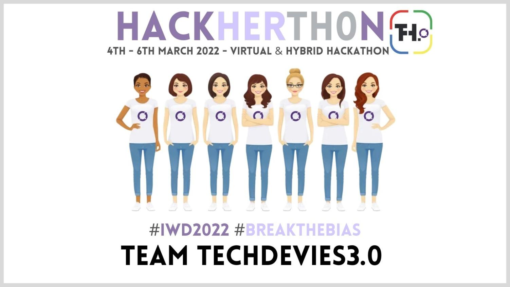

# Good Night Papa

“Half a million of the refugees are children, according to UNICEF, which warned Europe could be facing its largest refugee crises since World War II.”

This application was built for the refugee children fleeing the Ukraine/Russia conflict. This app was built for children refugees to help mitigate the stress of fleeing their lands.

## Motivation


This project was built for the International Women's Day HackHerThon 2022 hosted by [Th.0](https://thpoint0.io/).  In light of the recent events in Ukraine, we choose the "Marginalized Communities - Refugee Resettlement and Integration" challenge.  Our task was to create a product that could help the Ukranian women and/or children refugees resettle and integrate into their new communities.  

## Key Features

Based on our research of the mental health strategies used for trauma in children,  we have built three key features:

* Letter to Papa - write or record a message for someone left behind
* Happy Thoughts - calming questions to think about to stay positive
* Guided Sleep - Methods to calm a busy mind into a relaxed sleepy state


## Placeholders

We have placeholders for future games to help calm and support a happier mood.

## Technology Stack

* A Mobile first responsive SPA
* React
* JSON Server

## Installation
* Clone / download good-night-papa.
* Open the good-night-papa folder in code editor or terminal.
* Install dependencies with:
```
$ npm install
```
* Once complete, start the server with:
```
$ npm start
```
* Note:  A web browser should automatically open the Goodnight Papa website.  If not, you can open a browser and manually navigate to http://localhost:3000/.

## Acknowledgements
A big thank you to [Rebecca Lin](https://rebeccagl.in/) and Andrea Rascol, who were our UX designers for this project.  
